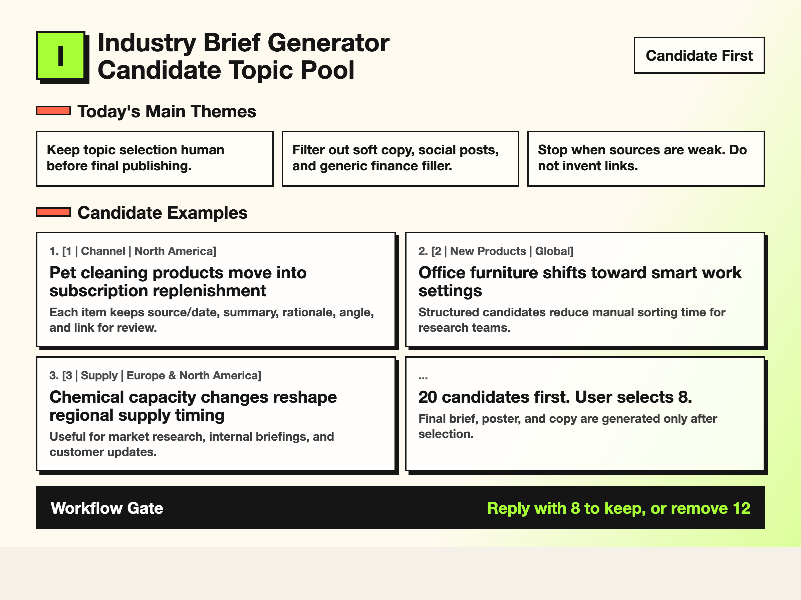
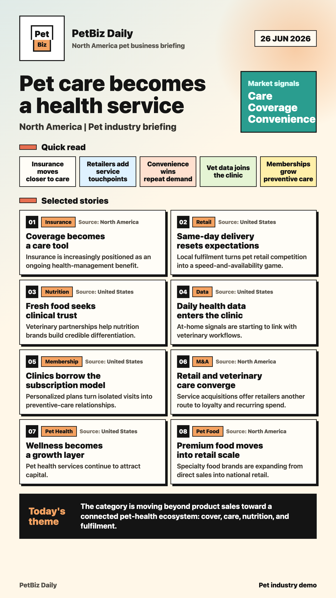
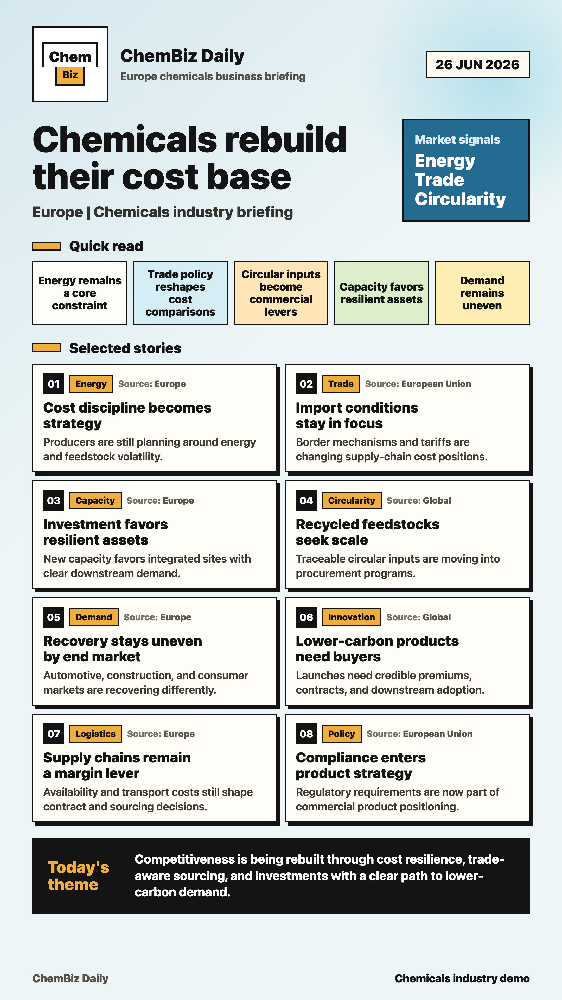
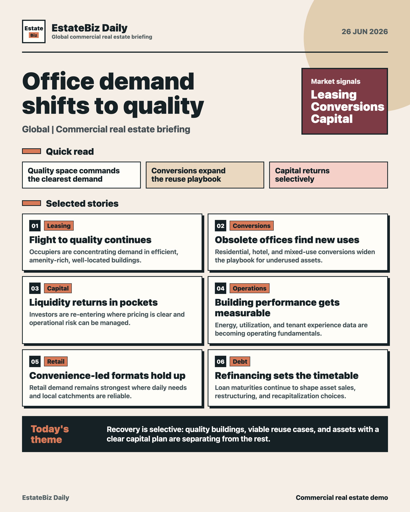

# Industry Brief Generator Skill

A universal industry brief generator.

Input an industry, target market, focus topics, exclusions, and final use. It first creates 20 sourced candidate topics. After you select 8, it generates the final brief, poster, and channel-ready copy.

Chinese edition: [industry-brief-generator-skill-zh](https://github.com/vchenchen/industry-brief-generator-skill-zh)

## Solves This Pain

The hardest part of a daily industry brief is not formatting. It is finding strong topics without turning soft copy into "industry news."

This skill separates research from publishing:

1. Generate a sourced candidate pool first.
2. Let the user choose the final stories.
3. Only then generate the final brief, poster, and copy.

## Demo

### Candidate Pool Preview



### Final Poster Demos

| Pet Industry | Chemicals | Commercial Real Estate |
|---|---|---|
|  |  |  |

Recommended demo prompts:

- Pet Industry | North America | Social Brief
- Office Supplies | Global | Internal Brief
- Chemicals | Europe and North America | Pricing, Supply, Capacity

## What It Does

- Takes an industry, target market, focus topics, exclusions, and final use case
- Searches current overseas industry news, trade shows, product launches, M&A, policy updates, and trends
- Produces 20 candidate topics before any final output
- Waits for the user to select 8 final items
- Generates internal briefs, customer updates, newsletter copy, social copy, or poster-style summaries
- Includes poster QA rules for text overflow, awkward line breaks, and crowded footer layouts

## Trust-First Rules

The most important feature is restraint.

This skill does not:

- fabricate sources, dates, company actions, or links
- turn social media posts into industry facts
- use generic finance news as filler
- generate final posters before the user selects final items

If public information is insufficient, it stops and asks for better sources, a narrower industry boundary, company names, or permission to include older background material.

## Good For

- consultants
- market research teams
- international business teams
- content operators
- industry media
- sales and BD teams
- export, distribution, and agency teams

## Install

This repository uses the Codex repository-scope skill layout:

```text
.agents/skills/industry-brief-generator-en/
```

Clone this repository and start Codex from the repository root. Codex should detect the skill automatically.

You can also install it from GitHub:

```bash
python3 /Users/vchen/.codex/skills/.system/skill-installer/scripts/install-skill-from-github.py \
  --url https://github.com/vchenchen/industry-brief-generator-skill-en/tree/main/.agents/skills/industry-brief-generator-en
```

If the skill does not appear, restart Codex.

## Quick Start

```text
Use $industry-brief-generator-en.

Industry: office supplies
Target market: global
Focus topics: industry news, trade shows, new products, distributor and agency opportunities
Excluded content: social media posts and corporate soft copy
Final use: internal company brief
Preferred output language: English
```

## Input Format

```text
Industry:
Target market, such as North America, Europe, APAC, or global:
Focus topics, such as M&A, pricing, supply and demand, capacity expansion, policy, trade shows, or new products:
Excluded content, such as generic finance, social media posts, or corporate soft copy:
Final use, such as internal brief, newsletter, customer update, or social post:
Preferred output language:
```

## Workflow

1. Read or create an industry config.
2. Search current sources and generate a candidate pool first.
3. Wait for the user to choose 8 item numbers.
4. Generate the final brief, poster, and channel copy.
5. Visually inspect the poster before delivery.

## Included Example Configs

- fitness
- chemicals
- pet industry
- hotels
- commercial real estate
- office supplies

## Repository Structure

```text
.agents/skills/industry-brief-generator-en/
├── SKILL.md
├── agents/openai.yaml
├── references/
└── assets/configs/
```

## License

MIT
